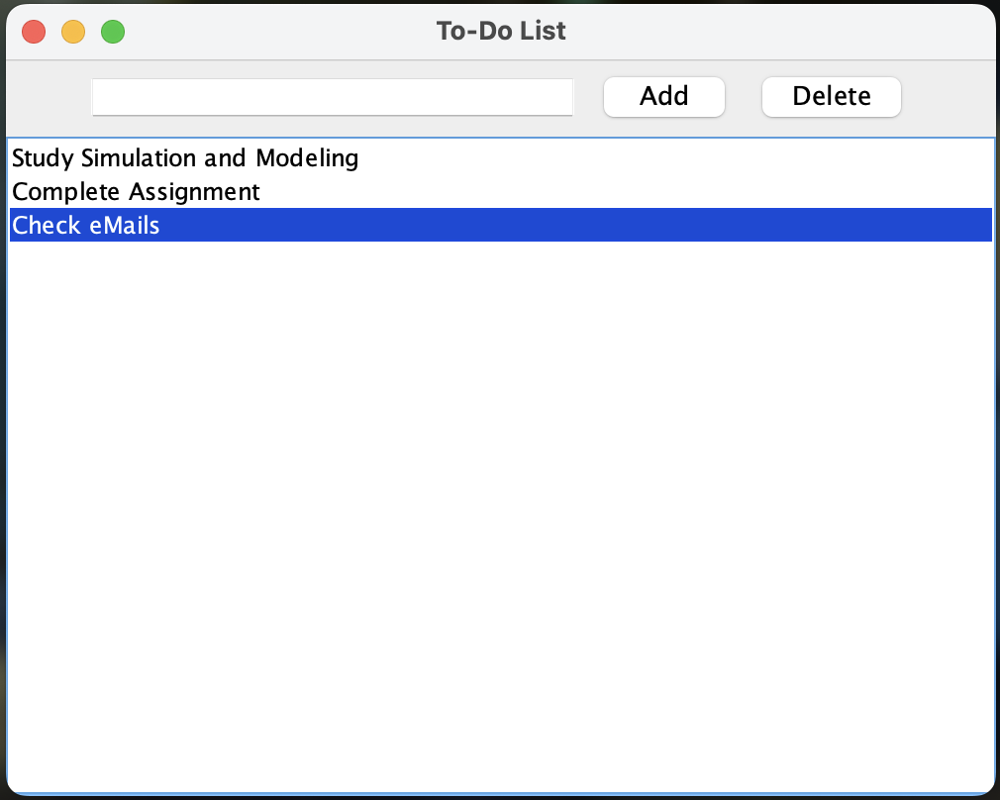

# Java Desktop ToDoApp

## Description

This is a Java Desktop ToDo application that performs CRUD (Create, Read, Update, Delete) operations for managing tasks.

## File Structure

```
.
├── LICENSE
├── README.md
├── ToDoApp.java
├── database
│   └── schema.sql
├── img
│   └── screenshort.png
├── jdbc-conn-test
│   └── JDBCTest.java
└── lib
    └── mysql-connector-j-8.3.0.jar
```

## Compilation

To compile the `ToDoApp.java` file, use the following command:

```bash
javac -cp .:lib/mysql-connector-j-8.3.0.jar ToDoApp.java
```

## Running the Application

To run the ToDoApp, execute the following command:

```bash
java -cp .:lib/mysql-connector-j-8.3.0.jar ToDoApp
```

## Screenshots


